# BACKLOG — 🎨 סוכן חזות

**בעלות:** `index.html` · `css/style.css` · `prototype-*.html`
לפני כל פריט: לקרוא את `NEXT.md`. חוקי העבודה ב-`AGENTS.md`.

**נעול — לא לשנות:** פונטים (Assistant) · פלטת הצבעים (#18163B · #5CBBF0 · #F6F5F2).
הוכרע ע"י OC ב-26.7.

---

## עכשיו

### D17. 🔴 גלריית האירועים הופכת לקרוסלה נעה — 13 תמונות חדשות מ-OC
**OC ‏3.8:** "אני מוסיף תמונות שתוסיף לאתר, ואני רוצה להפוך את התמונות
לקרוסלה כמו הביקורות."

**✅ הנכסים כבר במאגר.** ‏Cowork עיבד את 13 הקבצים (‏`SHIFT-*.jpg`,
‏~2.4MB כל אחד) ל-`assets/events/gallery-NNN.{webp,jpg}` — צלע ארוכה
1200px, ‏WebP q76 + ‏JPEG q78 גיבוי, בדיוק כמו חמש התמונות הקיימות.
**סה"כ ‏1.2MB WebP.** לא צריך לגעת בנכסים.

#### הכרעת OC ‏3.8: **רצועה אחת, 18 תמונות.** הגריד נמחק.
חמש התמונות הקיימות נכנסות לרצועה ומשתלבות בסדר הסיפורי — לא
נדחפות לסוף. ‏`.past-grid` וה-CSS שלו יורדים.

⚠️ **משקל — לבדוק לפני שמאשרים.** חמש הישנות נשמרו לפני שהצינור
הנוכחי היה קיים והן **כבדות מהחדשות**: `event-aerial.webp` לבדה
347KB, מול 212KB לכבדה שבחדשות ו-27KB לקלה. סה"כ הרצועה ≈2.5MB
עצל. **להעביר את חמש הישנות דרך אותו צינור** (צלע ארוכה 1200px,
‏WebP q76 + ‏JPEG q78) לפני שמוסיפים — צפוי לחסוך ~0.6MB בלי הבדל
נראה לעין. אם `npm run budget` נכשל, זה הצעד הראשון, לא הורדת תמונות.

#### הרצועה — הסדר מסופר, לא אקראי
הכנה → מרחב → מעגל → למידה → תרגול → קרח → שחרור → חיבור → דממה →
מבט-על. שתי התמונות האוויריות **פותחות וסוגרות בכוונה**: המרחב לפני,
המרחב מלא. לסירוגין רוחב/גובה כדי שהרצועה לא תיראה גושית.

**הסדר המלא (18):**
`event-booklets` · `event-aerial` · `gallery-099` · `event-teaching-wide` ·
`gallery-107` · `gallery-100` · `event-portrait` · `gallery-044` ·
`event-group` · `gallery-028` · `gallery-013` · `gallery-089` ·
`gallery-054` · `gallery-140` · `gallery-142` · `gallery-135` ·
`gallery-043` · `gallery-004`

ה-`<li>` של חמש הישנות קיים כבר ב-`.past-grid` — **להעביר אותם
כמות שהם** (כולל ה-alt המדויק שלהם, שכן מזכיר מקום ותאריך) ולהסיר
רק את `class="past-slot reveal delay-N"`.

**13 החדשות, מוכנות להדבקה במקומן בסדר שלמעלה:**

```html
<li class="past-shot"><picture><source srcset="assets/events/gallery-099.webp" type="image/webp">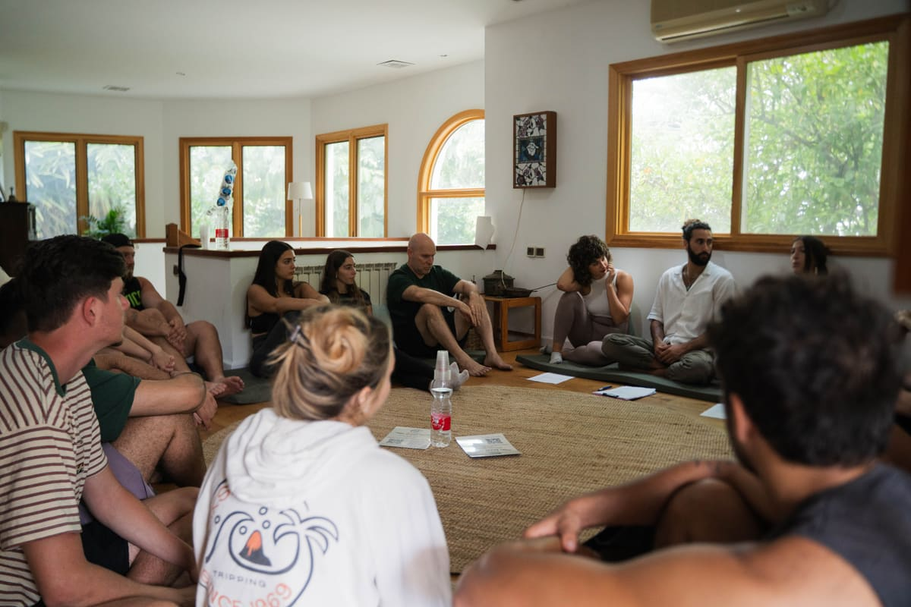</picture></li>
<li class="past-shot"><picture><source srcset="assets/events/gallery-107.webp" type="image/webp">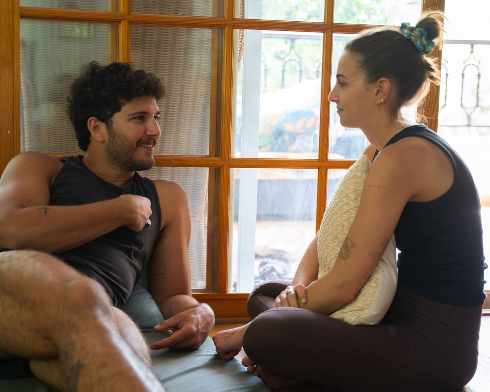</picture></li>
<li class="past-shot"><picture><source srcset="assets/events/gallery-100.webp" type="image/webp">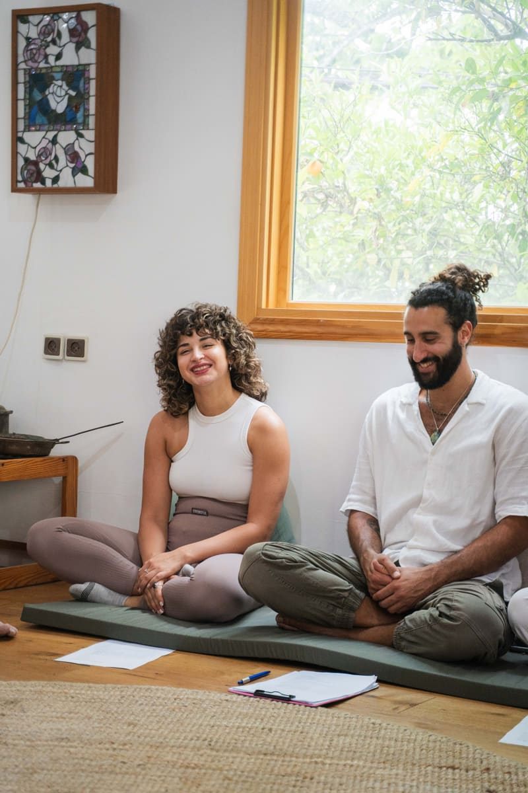</picture></li>
<li class="past-shot"><picture><source srcset="assets/events/gallery-044.webp" type="image/webp">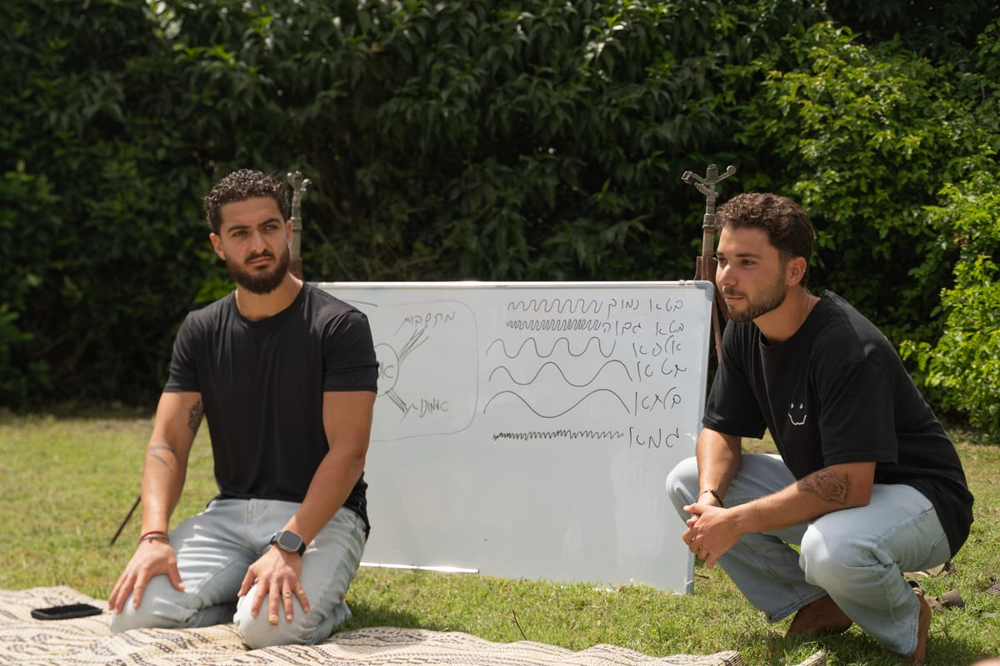</picture></li>
<li class="past-shot"><picture><source srcset="assets/events/gallery-028.webp" type="image/webp">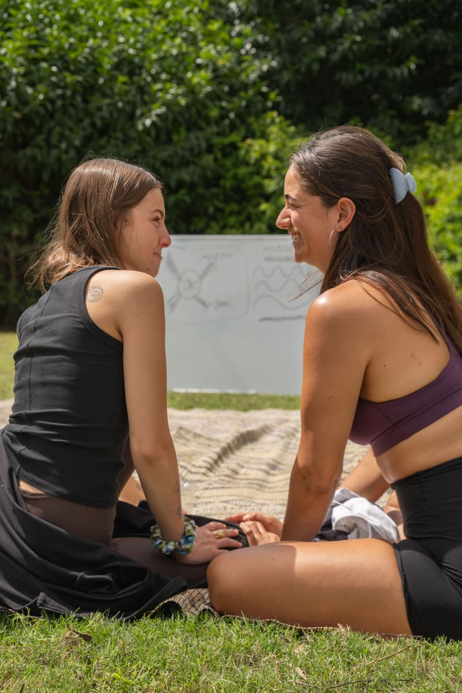</picture></li>
<li class="past-shot"><picture><source srcset="assets/events/gallery-089.webp" type="image/webp"></picture></li>
<li class="past-shot"><picture><source srcset="assets/events/gallery-054.webp" type="image/webp">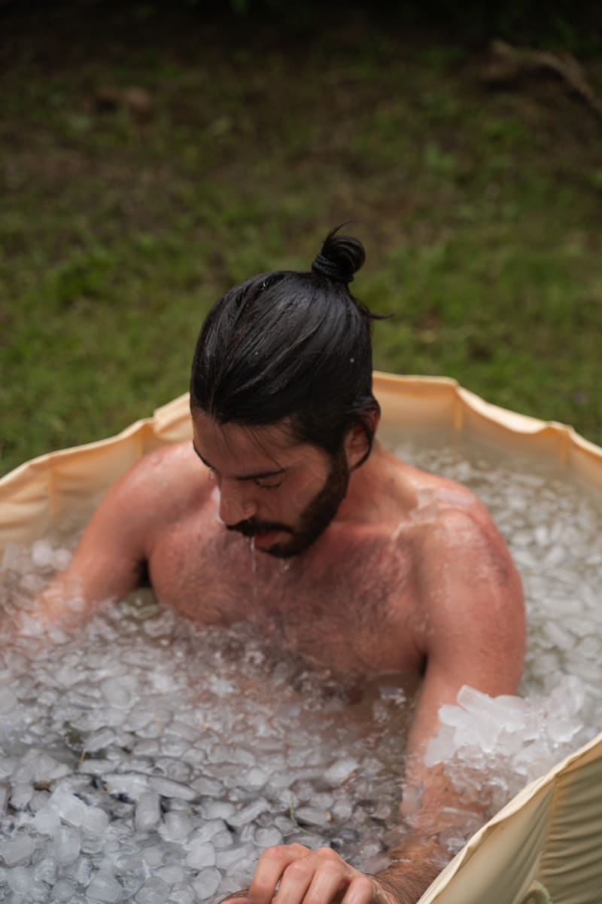</picture></li>
<li class="past-shot"><picture><source srcset="assets/events/gallery-140.webp" type="image/webp">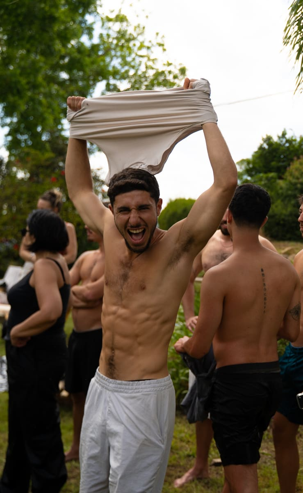</picture></li>
<li class="past-shot"><picture><source srcset="assets/events/gallery-142.webp" type="image/webp"></picture></li>
<li class="past-shot"><picture><source srcset="assets/events/gallery-135.webp" type="image/webp">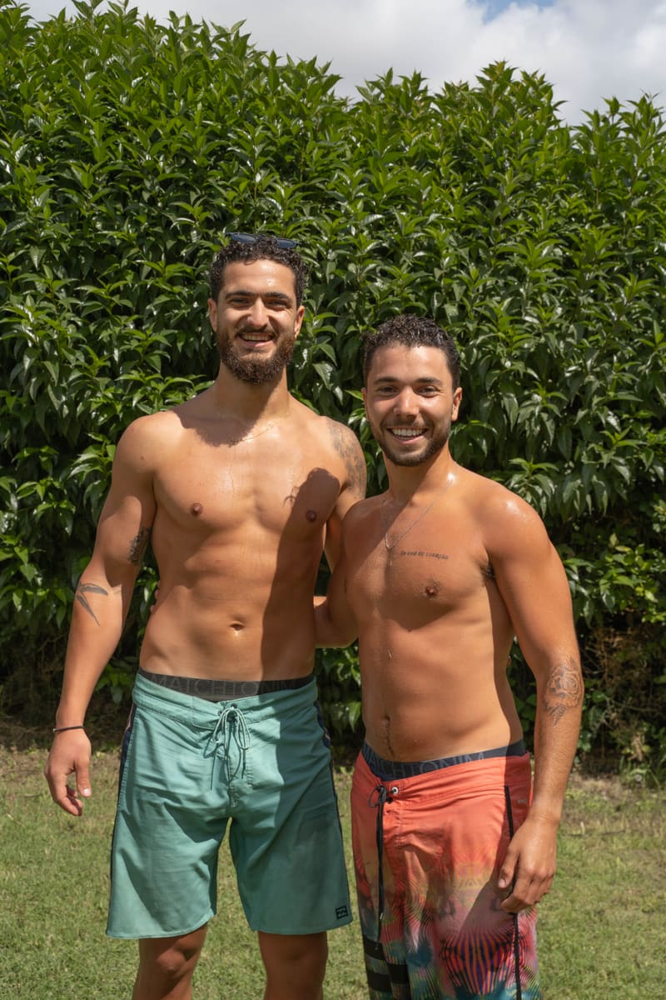</picture></li>
<li class="past-shot"><picture><source srcset="assets/events/gallery-043.webp" type="image/webp">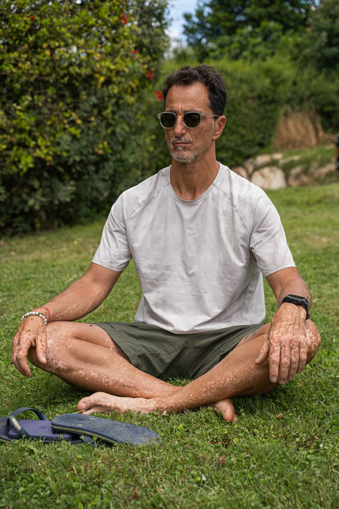</picture></li>
<li class="past-shot"><picture><source srcset="assets/events/gallery-013.webp" type="image/webp">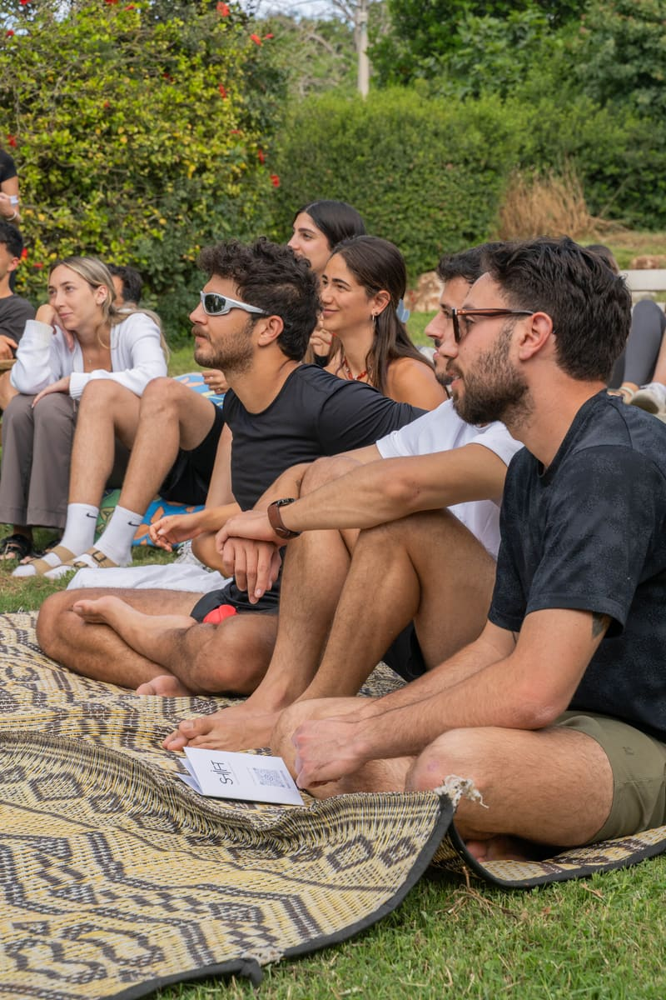</picture></li>
<li class="past-shot"><picture><source srcset="assets/events/gallery-004.webp" type="image/webp">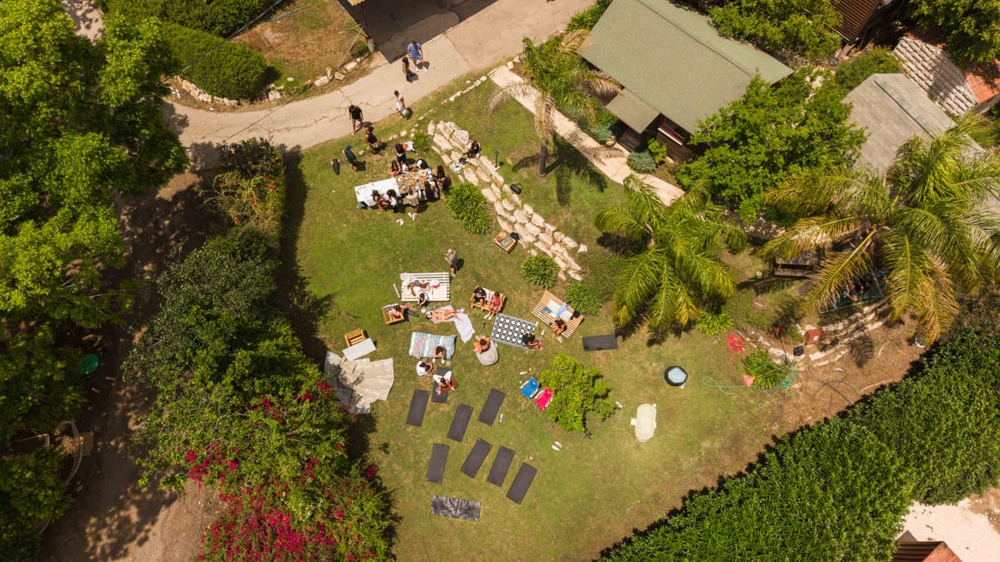</picture></li>
```

#### 🚨 המלכודת — היא תשבור את הלולאה בשקט
מנוע הביקורות משכפל עד ש-`strip.scrollWidth >= innerWidth * 1.25`.
עם **תמונות** הרוחב הזה נמדד **לפני** שהן נטענו. בלי `width` ו-`height`
על כל `` הדפדפן מחזיר רוחב אפס, הלולאה מתמלאת שגוי, ונוצר **תפר
או קפיצה** באמצע הרצועה. כל 13 השורות למעלה כבר כוללות אותם —
**לא למחוק, ולא "לנקות".** לאמת: להריץ עם רשת מואטת ולראות שהמעבר
בין סוף הרצועה לתחילתה חלק.

#### שימוש חוזר במנוע, לא העתקה
‏`main.js` תא `reviews-marquee` מקודד קשיח `.reviews-run` ·
`.reviews-strip` · `#reviewsPause`. **לא להעתיק את הבלוק** — שני
עותקים כמעט-זהים יסחפו זה מזה תוך שבועיים. להוציא פונקציה אחת
שמקבלת שלושת הסלקטורים ומהירות, ולקרוא לה פעמיים.
⚠️ **בעלות מכניקה** — שורה ב-`REQUESTS.md`.

#### מה נשאר, מה משתנה
- **הווידאו נשאר בראש** ובאותם תנאים (`preload=none`).
- **`past-grid` — הכרעת OC נדרשת:** האם חמש התמונות הישנות נכנסות
  לרצועה (18 סה"כ) או שהגריד נשאר מעליה? **עד תשובה: הגריד נשאר.**
- ‏**WCAG 2.2.2:** כפתור השהיה משלו, `id` נפרד. אותה התנהגות
  ‏`hover`/`focus-within`/`touch-hold`.
- **מופחת-תנועה:** בלי אנימציה ובלי כפתור, רצועה נגללת ידנית — כמו
  בביקורות.
- **בלי JS:** רצועה סטטית שנגללת נטיבית.
- **גובה אחיד** לכל השקופיות + `object-fit: cover`, אחרת רצועה
  מעורבת רוחב/גובה תקפוץ.

#### אימות
- ‏`npm run budget` — **+1.2MB עצל.** אם חורג, לרדת ל-1000px צלע
  ארוכה לפני שמוותרים על תמונות.
- ‏`npm run a11y` · `console` · מובייל 390 · מקלדת בלבד.
- ‏VR: `d-past-events`/`m-past-events` — **רצועה נעה אינה דטרמיניסטית.**
  להקפיא את האנימציה בצילום (כמו שנעשה לקנבס ההגעה), אחרת הבייסליין
  ייכשל אקראית. לוודא שתי ריצות זהות.

⚠️ **שתי שאלות פתוחות ל-OC — נשאלו בצ'אט 3.8, לא לנחש:**
‏(א) מאיזה אירוע התמונות? כותרת הסקשן אומרת "בית לחם הגלילית, מאי 26".
**לכן ה-alt לא מזכיר מקום ותאריך** — נכון בכל מקרה.
‏(ב) הסכמת המצולמים לפרסום באתר פומבי.

נוסף 3.8 ע"י Cowork · הנכסים עובדו ואומתו.

### D16. ✅ 🔴 כותרת שבוע 3 תוקנה מהמסלול החי (3.8) — אומת מול Firestore ישירות
**OC ‏3.8:** "באתר הימים לא בדיוק כפי שמופיע במסלול."

**נבדק מול Firestore החי (מקור האמת), ‏3.8. הממצא מדויק:**

| | תוצאה |
|---|---|
| ‏21 כותרות הימים | ‏**21/21 זהות** |
| הסדר | תקין, ‏1→21 |
| ימים חסרים | אין |
| חלוקה לשבועות | ‏7/7/7, תקינה |
| כותרות שבוע 1 ו-2 | זהות |
| תיאורי שלושת השבועות | זהים |
| **כותרת שבוע 3** | **✗ נסחפה** |

**התיקון — `index.html` שורה ~645:**
```
-  <h3>שבוע שלישי — תרגול והטמעה</h3>
+  <h3>שבוע שלישי — מהגוף אל החיים, וכיוון קדימה</h3>
```

זה הכל. **לא לגעת בשום דבר אחר בסקשן** — כל היתר אומת תו-בתו.
`?v=` לעדכן. ‏VR: `d-program`/`m-program` — בייסליין חדש (שינוי מלל
מכוון). נוסף 3.8 ע"י Cowork.

⚠️ **הערה ל-OC בצ'אט:** אם מה שנראה לך שונה הוא משהו *אחר* מהכותרת
הזו — תגיד לי מה בדיוק ראית. את מסך המשתמש המחובר בפלטפורמה אני לא
יכול לראות (הוא מאחורי זהות של משתמש אמיתי), ולכן בדקתי מול המסד.

### D15. ✅ 🔴 ההצהרה הוחזרה (3.8) — ביטול מדויק לפי הרשימה; גבולות צולמו
**אי-הבנה, לא באג.** ב-`3f9f000` (2.8 17:57) נבנה רקע "לילה עמוק" על סקשן
ההצהרה — "המציאות היא לא מה שאנחנו רואים". **OC התכוון להגעה בסוף הצלילה**,
וזו כבר קיבלה את הטיפול שלה ב-`9f4e075`. ההצהרה חוזרת בדיוק למה שהייתה.

לבטל מ-`3f9f000`, בקבצים האלה בלבד:
- `index.html` — `<section class="statement section-dark">` → `section-light`,
  ולמחוק את הערת ה-🌌 שמעליו.
- `css/style.css` — `.statement` חוזר לשורה אחת:
  `.statement { padding: clamp(90px, 14vw, 150px) 0; text-align: center; }`
  (למחוק את שלוש שכבות הרקע ואת הערת ה-🌌).
  `.statement-text` — `color` חוזר מ-`var(--white-soft)` ל-`var(--ink-soft)`.
- `js/main.js` — ההצהרה חוזרת למפת המקורות הבהירים של nav-tone.
  ⚠️ בעלות מכניקה — אם הסוכנים מופרדים, שורה ב-`REQUESTS.md`.
  לאמת: הסרגל במצב **בהיר** מעליה.
- `BRAND-DESIGN.md` — למחוק את כלל "לילה עמוק".
- `RHYTHM.md` — לבטל את הסימון.

**לא לבטל:** התוספת ב-`scripts/vr.mjs` (`.statement` בסט המובייל של VR) —
הרחבת כיסוי טובה, נשארת.

VR: `d-statement` ו-`m-statement` חוזרים לבייסליין שלפני `3f9f000`. אם הישן
בהיסטוריה — לשחזר אותו, לא לאמץ חדש.

⚠️ **הרצף אחרי השינוי:** צלילה → הגעה כהה וחיה → **הצהרה בהירה** → מוצרים.
לצלם את שני הגבולות ל-`delivery/` ולוודא שאף אחד לא נראה כמו תפר.
`?v=` לעדכן. נוסף 3.8 ע"י Cowork.

### D13. ⏸ דיוק התוכן — פרויקט מלל חוצה-אתר (בהובלת Cowork מול OC)
OC ‏28.7: "התוכן באתר לא מדויק בכלל". Cowork מסנתז מהמאגרים ומגיש
ל-OC טיוטת מלל סקשן-סקשן; **שום שינוי מלל באתר עד אישור OC מפורש
לכל סקשן.** מקורות: ‏01_research_synthesis · חוברת SHIFT · מפת-הפרויקט ·
‏data.js החי · זיכרון המותג. נוסף 28.7 ע"י Cowork.

### D11. ⚠️ עודכן בהכרעת OC ‏29.7: איזאנמי הוסר מהרפרנסים — רפרנס 1 (הנקודה הנושמת) יורד מהאתר; 2+3 (אלת'יה) נשארים. ראה NEXT.md.
~~רפרנסים 1+2 חיים (28.7) · 3 ממתין בכוונה~~
**1 — פרט חי בשוליים:** נקודת-שמיים נושמת ליד "מהישרדות ליצירה" בפוטר,
בקצב תרגיל הנשימה של האתר עצמו (מחזור ‏8.7ש' — שאיפה/השלמה/נשיפה
ארוכה). ‏reduced-motion: נקודה סטטית. ‏CSS בלבד.
**2 — פוטר כרגע-מותג:** מילת הענק גדלה ל-‏19vw (כמעט מלוא הרוחב),
נוכחת מעט יותר (‏stroke ‏0.26), והפוטר צומצם אליה (‏64→36) — המילה
ושורת הזכויות נקראים כרגע סגירה אחד, כמו באלת'יה אבל בשקט שלנו.
**3 — מיקרו-תוויות בצלילה: ✅ חי (שוחרר בסבב 14:05, בוצע מיד אחריו).**
שלוש תחנות בשולי הצלילה, בשפת העמוד בלבד (תגובתיות אוטומטית ‏0.14 →
נוירופלסטיות ‏0.44 → בחירה ‏0.64), משולבות בין מילות-המסע (חלון ±0.07
מול ±0.1 שלהן), עם תג-מדידה קטן — שכבת "דאטה" שקטה, לא שורה פואטית
רביעית. תנאי 14:05 קוימו: שפה קיימת ✓ · ‏reduced-motion מוסתרות
(display:none + המנוע ממילא לא רץ) ✓ · דטרמיניזם VR — פונקציה טהורה
של ‏p, ‏d-dive-end (‏p=1) מחוץ לכל חלון; שתי ריצות VR זהות ✓ · שער מלא
‏13/13 ✓. מובייל: בלי (מיקרו-עידון דסקטופי).
פונטים/צבעים לא נגעו. נוסף 28.7 ע"י Cowork.

### D1-מקורי
הפרויקט הגדול נסגר — אף אחד עוד לא הסתכל על התוצאה **כחוויה אחת רציפה**.
לגלול לאט מלמעלה למטה ב-1440 וב-390, ולרשום כל מקום שבו:
- הקצב נשבר (סקשן שמרגיש מהיר מדי או איטי מדי ביחס לשכניו)
- העין לא יודעת לאן ללכת
- שני דברים סמוכים נראים כאילו נכתבו ע"י שני אנשים
לתעד ב-`REVIEW-design.md` עם צילומי מסך. **לא לתקן עדיין** — קודם למפות.

### D8. 🔒 סקשן האירועים — ממתין לתוכן אמיתי מ-OC
9 סימוני TODO. אפשר לשפר את המבנה והקצב בלי להמציא פרטים.

---

### D14. 🟢 קוד מת מ-D12 — חוקי `.path-track`/`.path-line` ב-CSS
‏D12 (29.7) הסיר את המסילה מה-HTML; נשארו ~4 בלוקים ב-`style.css`
‏765–842 (כולל ענפי מובייל/reduced-motion). מחיקה נקייה, אפס שינוי
ויזואלי צפוי. נוסף 29.7 ע"י Cowork.

## פרויקטי רקע — כשהתור ריק

### מרפרנסים (DB) — מועמדים להכרעת OC, לא יושמו

1. **פרט חי בשוליים** (איזאנמי: שעוני דובאי/טוקיו רצים בפוטר) — מקבילה
   שלנו: נקודה נושמת ליד הלוגו בפוטר, או "יום N מתוך 21" חי. זול, נותן דופק.
2. **פוטר כרגע-מותג** (אלת'יה: wordmark ענק על וידאו בסוף) — SHIFT גדול
   לפני שורת הזכויות; סוגר את המעגל שהשער פותח.
3. **מיקרו-תוויות בצלילה** (אלת'יה: תגיות דאטה מוצמדות ל-3D) — 2–3 תוויות
   אנטומיות זעירות שחולפות עם הפריימים. הכבד מהשלושה; רק אם OC ירצה.

---

## סגורים (תקציר; הפירוט המלא ב-`BACKLOG-ARCHIVE.md`)

- D12. ✅ ‏#path נבנה מחדש — הבמה החיה + תיקון באג אמיתי (29.7)
- D9. ✅ שני השלבים בוצעו — סרטון העיניים (שלב ב' = T15, חווט 28.7 ‏12:28 `6bfdfbc`; עודכן ע"י Cowork 14:05)
- D10. ✅ סקשן "אירועים קודמים" — המבנה חי (28.7)
- D0. ✅ 🔴 — תוקן בלילה בשני סיבובים; Cowork: "סגור סופית ✅" (REVIEW ‏28.7 ‏02:05)
- D1. ✅ מעבר עיניים — **המיפוי הושלם** (27.7 אחה"צ). מיפוי, לא תיקון.
- D2. ✅ המעבר מהישרדות ליצירה — נמדד, והציר החסר הושלם (27.7)
- D3. ✅ תרגיל הנשימה — שלוש התשובות ניתנו (27.7)
- D4. ✅ מובייל כחוויה — נבדק 27.7 בשלושת הרגעים הקריטיים
- D5. ✅ מיקרו-קופי — הצעות ב-`delivery/COPY.md` (27.7), ממתין ל-OC
- D6. ✅ ההצהרה והסיפור — מכוסים ומאומתים (27.7)
- D7. ✅ סוף העמוד — מסיים, לא סתם נגמר (27.7)
- DA. ✅ מפת הקצב — `RHYTHM.md` (27.7), נמדד מהדף החי
- DB. ✅ השוואת רפרנסים (28.7, לילה) — `delivery/DB.md`
